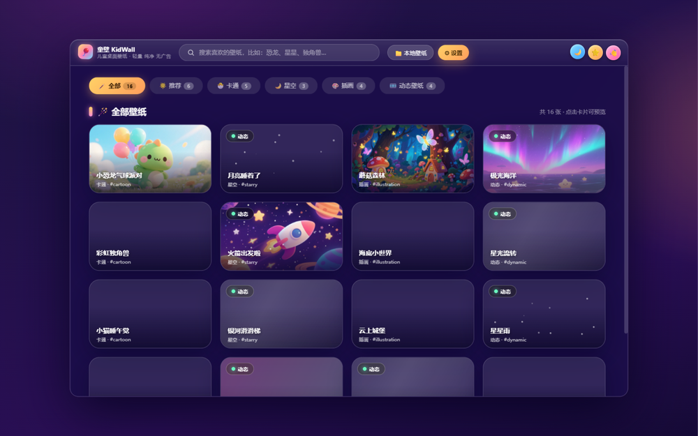

# KidWall｜童壁
> 专为儿童设计的开源桌面壁纸软件，支持静态图片、动态壁纸，轻量纯净，无广告。

✨ 核心特性
- 🖼️ 静态图片壁纸：本地图片一键设置桌面
- 🎞️ 动态壁纸支持：动画、视频类动态桌面
- 🧒 面向儿童：界面简洁，壁纸资源偏向童趣画风
- ⚡ 轻量低占用：后台资源消耗小，不打扰孩子学习使用电脑
- 🔓 完全开源：可自由二次修改、扩展壁纸源

> 适合家长给孩子电脑配置桌面，自定义孩子喜欢的卡通、星空、插画桌面背景。



## 下载安装

从 [GitHub Releases](https://github.com/dotnet9/KidWall/releases/latest) 下载最新安装包（附 `.sha256` 校验）：


- Windows x64：`KidWall-v*-win-x64-setup.exe`（简体中文安装向导）
- Linux x64 / arm64：`KidWall-*-linux-x64.deb`、`KidWall-*-linux-arm64.deb`
- macOS x64 / arm64：`KidWall-*-osx-x64.dmg`、`KidWall-*-osx-arm64.dmg`

> 各平台功能差异：Windows 支持全部功能（静态 + 动态壁纸）；macOS 支持静态壁纸；Linux 壁纸设置开发中（应用内提示）；动态壁纸（依赖 VLC）仅 Windows 生效。

## CI/CD：自动发布安装包

推送 `v*` 标签（例如 `v1.0.0`，与 `Directory.Build.props` 的 `<Version>` 一致）会触发 [.github/workflows/release.yml](.github/workflows/release.yml)：先跑全部测试，再为 win-x64 / linux-x64 / linux-arm64 / osx-x64 / osx-arm64 五个平台发布自包含程序，分别打包为 Inno Setup 中文安装包（Windows）、deb（Linux）、dmg（macOS），最后创建 GitHub Release。也可以在 Actions 页面手动触发并输入版本号。

动态壁纸依赖 Windows 切壁纸接口与 Windows 版 VLC 原生库，仅 Windows 生效；macOS 支持静态壁纸，Linux 壁纸设置开发中。

本机构建安装包（需安装 [Inno Setup 6](https://jrsoftware.org/isinfo.php)）：

```powershell
dotnet publish src/KidWall.App/KidWall.App.csproj -c Release -f net10.0-windows -r win-x64 --self-contained true -p:PublishSingleFile=true -o artifacts/publish/win-x64/KidWall.App
./scripts/build_installer.ps1 -Version 1.0.0
```

## 发布

标准发布流程与发布说明规范见 [docs/RELEASE.md](docs/RELEASE.md)。
